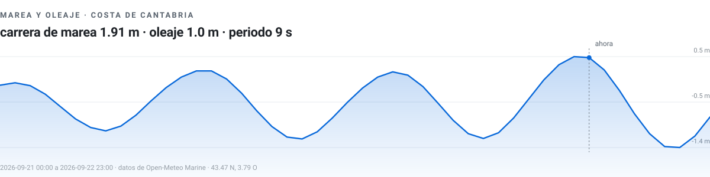

<picture>
  <source media="(prefers-color-scheme: dark)" srcset="assets/header-dark.svg">
  
</picture>

Desarrollo interfaces web con Vue 3. Trabajo sobre todo con datos científicos y
medioambientales: visores de series temporales, mapas y paneles de análisis que
tienen que seguir siendo rápidos y legibles cuando el volumen crece.

<picture>
  <source media="(prefers-color-scheme: dark)" srcset="assets/focus-dark.svg">
  
</picture>

<picture>
  <source media="(prefers-color-scheme: dark)" srcset="assets/marea-dark.svg">
  
</picture>

| | |
| :---: | :---: |
| <picture><source media="(prefers-color-scheme: dark)" srcset="https://github-profile-summary-cards.vercel.app/api/cards/most-commit-language?username=calderon0803&theme=github_dark"></picture> | <picture><source media="(prefers-color-scheme: dark)" srcset="https://github-profile-summary-cards.vercel.app/api/cards/productive-time?username=calderon0803&theme=github_dark"></picture> |

<picture>
  <source media="(prefers-color-scheme: dark)" srcset="assets/stack-dark.svg">
  
</picture>

---

Fuera del trabajo: deporte, coleccionismo y cultura japonesa.

[LinkedIn](https://www.linkedin.com/in/carlos-calderon-palacios/)
